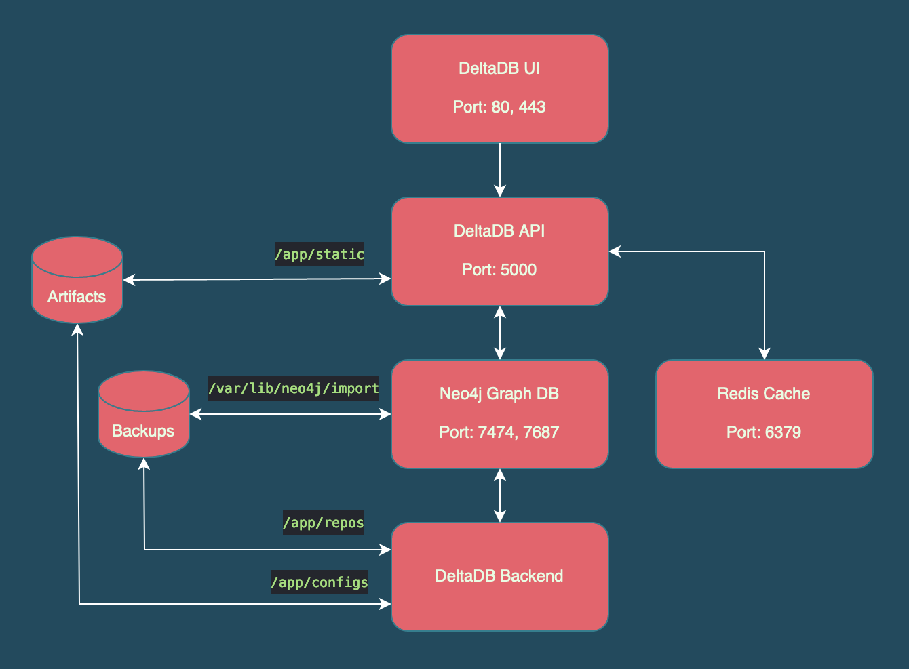

# deltaDB Statistical Analysis App

## Table of contents
* [Design](#design)
* [Technologies](#technologies)
* [Installation](#installation)
* [Setup](#setup)
* [Logging](#logging)

## Design



## Technologies

### [deltaDB UI](https://github.com/joshwi/deltadb-ui)

- deltaDB UI is a react web application that uses the deltaDB REST Server to display football statistics.

### [deltaDB Server](https://github.com/joshwi/deltadb-api)

- deltaDB Server is an REST API server that communicates with the React.js frontend, Redis Cache, and Neo4j Graph DB.

### [deltaDB Collector](https://github.com/joshwi/go-scripts)

- deltaDB Collector is a collection of go scripts that perform templated http collection and regex parsing.

### [Neo4j DB](https://github.com/joshwi/deltadb/tree/master/app/neo4j)

- Graph DB Backend for storing key value nodes and relationships between nodes.

### [Redis Cache](https://github.com/joshwi/deltadb/tree/master/app/redis)

- Redis Cache keeps track of background tasks for the API and caches common queries from the React frontend.

## Installation

1. Clone the deltaDB Repository 
```
git clone https://github.com/joshwi/deltadb.git
```
2. Create & open .env in editor: 
```
nano .env
```
3. Paste variables and input proper values
```
- DELTADB_HOST=www.evilcorp.com
- DELTADB_UI_PORT=443
- DELTADB_API_PORT=5000

- REDIS_HOST=cache.evilcorp.com
- REDIS_PORT=6379

- NEO4J_HOST=db.evilcorp.com
- NEO4J_PORT=7687
- NEO4J_USERNAME=neo4j
- NEO4J_PASSWORD=guest

- AUTH0_HOST=https://XXX-XXXXXXXX.XX.auth0.com
- AUTH0_CLIENT_ID=XXXXXXXXXXXXXXXXXXXXXXXXXXXXXXXXXXX

- REPO_DIRECTORY=/home/root/deltadb/repos
- LOG_DIRECTORY=/home/root/deltadb/logs
```
4. Run setup shell script: 
```
bash setup.sh
```
5. Run docker-compose file to build app: 
```
sudo docker-compose up -d
```
6. Navigate to URL:
```
http://localhost
```

